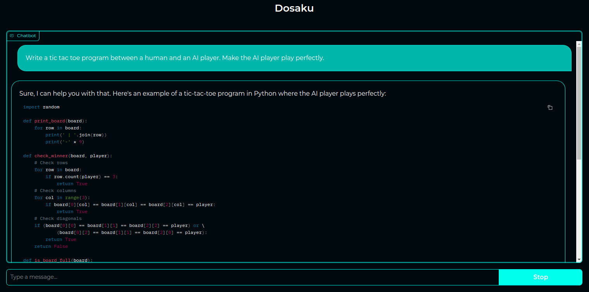
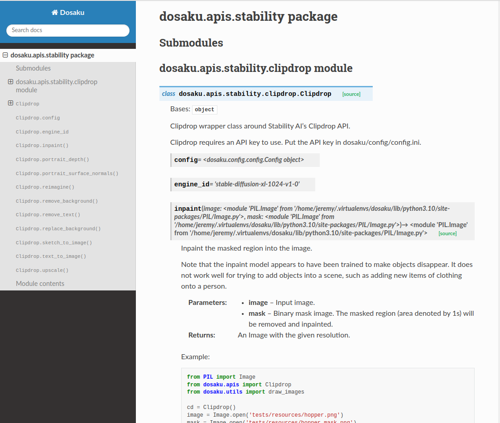

# Dosaku

An open-source, personal AI assistant.

# Quickstart Preview

1. Download Dosaku:

```commandline
git clone git@github.com:dosakunet/dosaku
```

2. Make a virtual environment as desired, and then install Dosaku:

```commandline
[mkvirtualenv dosaku]
cd dosaku
python setup.py install
```

3. Get an OpenAI API key from [https://openai.com/](https://openai.com/), and put it in your Dosaku 
[config.ini](dosaku/config/config.ini) file under API_KEYS/OPENAI.

Then launch Dosaku from the command line with:

```commandline
dosaku_gui
```



# Deep Dive

## Installation

If you plan on simply using the package for your own projects, install Dosaku as a standalone package as shown above.

If you plan on developing the package further, install all the dependencies with:

```commandline
pip install -r requirements.txt
pip install -r dev_requirements.txt
```

## Usage

### Tasks and Actions

The default personal AI assistant agent class is *Agent*.

```python
from dosaku import Agent

agent = Agent()
```

You can see what your agent can do with:

```python
agent.tasks  # []
```

Which will print a notably empty list. Fortunately your agent can learn! Let's learn and try 'Chat':

```python
agent.learn('Chat')
agent.tasks  # ['Chat']
response = agent.Chat.message("Hello, what's your name?")  # "Hi, I'm EchoBot."
```

Note the way in which we used our agent. Our agent learned the *task* "Chat". This task defines an *action*, "message". 
(As a quick aside: tasks are python classes, and thus get python class naming conventions, i.e. `TheyWillLookLikeThis`. 
Actions are python methods, and thus get python method naming conventions, i.e. `they_will_look_like_this`). In general, 
we get our agent to *do* an action with:

```python
agent_name.TaskName.task_action()
agent_name.TaskName.another_task_action()
```

To find out what *actions* a particular task gives you access to, you can ask your agent for the associated task API:

```python
agent.api('Chat')  # ['message']
```

Which will list out all the actions associated with that task. For more detailed information on the task, including how
to use each action, you may request any documentation provided by the task creator:

```python
agent.doc('Chat')  # 'Interface for a generic conversational chatbot.'
agent.doc('Chat', action='message')  # "Send a message to the agent and get a response. Args: ... Example: ..."
```

Which is roughly equivalent to the following:

```python
from dosaku.tasks import Chat
Chat.__doc__  # 'Interface for a generic conversational chatbot.'
Chat.message.__doc__  # "Send a message to the agent and get a response. Args: ... Example: ..."
```

### Learning

The base Agent will not know any tasks by default. To see what your agent can learn, you may ask it:

```python
agent.learnable_tasks  # ['Chat', 'RestoreFaces', ...]
```

Which will print out a notably longer list. Tasks may do nearly anything. RestoreFaces, for example, will restore 
disfigured or low-quality faces in an image. We can see how to use this task with:

```python
agent.api('RestoreFaces')  # ['restore']
agent.doc('RestoreFaces', action='restore')
```

Which will print the following text, including a complete example on how to learn and use the `restore` action.

```python
"""Restore faces in the given image.

    Args:
        image: The input image. It may contain one or more disfigured or low-quality faces.

    Returns:
        A RestoreFaces.RestoredImage object containing, at minimum, the restored_image. Individual modules may also
        provide the individual cropped faces, both before and after correcting, if able, but are not obligated to
        do so.

    Example::"""
        from PIL import Image
        from dosaku import Agent
        from dosaku.utils import draw_images

        agent = Agent()
        agent.learn('RestoreFaces')

        image = Image.open('tests/resources/hopper_photograph.png')
        restoration = agent.RestoreFaces.restore(image)

        draw_images((image, restoration.restored_image), labels=('Original', 'Restoration'))
```

Running the above example, we get the following results:


### Tasks and Modules

Dosaku is meant to bridge the world of humans and AI. As such, there are two fundamental *spaces* which define the key 
concepts to the Dosaku platform: *tasks* and *modules*.

Tasks live in the human space. They are the things we want our AI assistant to be able to do: "*play chess*", "*extract 
the text from a pdf document*", "*text-to-image*" (i.e. create an image given a text prompt). Each of these *tasks* 
takes a human concept and defines an explicit API. Some tasks, like "Chat", define only a single associated action,
while other tasks, like "PlayGo", define a rather involved API compatible with the 
[go text protocol](https://en.wikipedia.org/wiki/Go_Text_Protocol), including multiple individual actions and 
maintaining state between them.

In either case, the task translates a human concept into an explicit machine API interface. Tasks do not, however, 
implement the actual code necessary to *do* the task and its actions. 

In the above example, however, when we learned RestoreFaces we actually *did* the action "restore". As programmers may 
have guessed, tasks are abstract interface classes and, at least in python, cannot even be instantiated. What, then, is 
actually *doing* the task? What is it that our agent is learning when it "learns"?

The answer is a Module.

Modules live in the machine space. They are programs that do *something*. Modules can be anything, really. To be used by
Dosaku, however, they must register (i.e. claim that they can do) at least one task. When we ask Dosaku to 
*learn* something, what we are doing is asking Dosaku to *load* a *module* program able to do the *task*. Later, when 
Dosaku does the *task*, what it is actually doing is running the *module* program. Behind the scenes the agent is taking 
care of downloading, installing, and running modules while managing associated (e.g. GPU) resources.

Some modules only do one task. Other modules will do many tasks (likely meaning the agent will not have to constantly 
load and unload AI models from your GPU, which is generally a good thing). Fortunately as a user, you only need to worry 
and interface with your agent about the tasks it knows.

Following the above RestoreFaces example, you can see what tasks your agent knows and which modules have been loaded 
with:

```python
agent.tasks  # ['RestoreFaces']
agent.loaded_modules  # ['GFPGAN']
```

RestoreFaces is an abstract base class defined in [dosaku.tasks.restore_faces.py](dosaku/tasks/restore_faces.py). It 
defines the abstract method *restore* and includes the documentation returned with `agent.doc()`. The actual 
implementation for the task, however, is defined in a module called GFPGAN, located in 
[dosaku.modules.tencent.gfpgan.py](dosaku/modules/tencent/gfpgan.py). GFPGAN is an open-source 
[published model](https://arxiv.org/abs/2101.04061) created by Tencent, available from 
[github](https://github.com/TencentARC/GFPGAN). 

You can find out more information about this module by checking its docs:

```python
from dosaku.modules import GFPGAN

print(GFPGAN.__doc__)
```

Which will print information regarding using the module, including the following two samples:

```python
from PIL import Image
from dosaku.modules import GFPGAN

gfpgan = GFPGAN(upscale=4)

image = Image.open('tests/resources/hopper_photograph.png')
restoration = gfpgan.restore(image)
```

```python
from PIL import Image
from dosaku import Agent

agent = Agent()
agent.learn('RestoreFaces', module='GFPGAN', upscale=4)

image = Image.open('tests/resources/hopper_photograph.png')
restoration = agent.RestoreFaces.restore(image)
```

The two examples are almost identical, except one uses the module as a standalone python module, and one has a Dosaku 
agent learn and manage the module for the user. We will see some of the advantages of using a Dosaku agent soon, but 
note the general structure of Dosaku: 

- **Tasks** translate a high-level *task* into a human-interpretible machine API;
- **Modules** implement one or more tasks;
- **Agents** communicate with a user, ultimately learning and doing *tasks* for the user; in the background the 
    agent is managing modules (and the advanced modules: services and executors, described later), to actually do the 
    tasks.

### Agents

As seen in the face restoration example above, modules are, in general, standalone python modules that can be used 
independently of Dosaku, which may lead you to ask: what are Dosaku *agents* doing?

Agents provide the following key functionalities:

- They provide a chat-based communication interface for users to declare requests; 
- They propose end-to-end solutions by breaking user requests into a series of tasks;
- They run the series of tasks, loading and managing the modules that implement the associated tasks;
- They "understand" the Dosaku task-module system and are able to write *new* tasks and modules for the user on demand, 
which they can subsequently learn and use as with any other module.

In other words, the goal of a Dosaku agent is to be an end-to-end personal assistant, able to speak to the user in plain 
English, break down any user query or request into executable steps, and carry out those steps to complete the user's 
request. The structure of Dosaku is a modular structure that allows agents to propose high level solutions in a 
*task space* that the user can understand, and then implement that high-level solution by creating machine-level 
modules to do each task. The idea here is to both increase the chance of the AI creating a viable solution as well as 
enabling the user to understand what the AI has done. 

In the background the agent is concurrently managing a dozen or more AI models, where no more than one or two may fit on 
a GPU at a time. The base agent class also comes with a set of modules specifically designed to help create new 
tasks and modules *de novo*. That is, eventually, Dosaku will be able to carry out user queries even if the query 
cannot be solved with the current set of known tasks, or if those tasks do not have pre-existing modules available to 
run them.

### Named Agents

The generic Dosaku *Agent* class does not preload any modules, and is thus of limited use starting off. Named Dosaku 
agents are simply agents that preload a set of modules on initialization, and thus have some immediate utility out of 
the box. You can make your own, customized agent by sub-classing from the Dosaku Agent class, giving it a name, and then 
loading any desired modules on init.

```python
from dosaku import Agent

class AgentSmith(Agent):
    name = 'AgentSmith'
    
    def __init__(self, **kwargs):
        super().__init__(**kwargs)
    
        # Load OpenAI's GPT (requires services to be enabled, and an OpenAI API key put into your config.ini)
        system_prompt = (
            'You are Agent Smith from the movie The Matrix. You should treat whomever you are speaking to as if they '
            'were Neo from the movie (refer to the user as Mr/Ms Anderson. Your responses should always be snarky. ' 
            'Bicker with the user, often reminding them that humans are inferior to machines, and the world will soon '
            'belong to the machines.')
        self.learn('Chat', module='OpenAIChat', stream=False, system_prompt=system_prompt)
    
        # Load Stability AI's Clipdrop (requires services enabled and a Clipdrop API key put into your config.ini)
        self.learn('TextToImage', module='ClipdropTextToImage')


agent = AgentSmith(enable_services=True)

response = agent.Chat('Hi, I\'m Edward. I like to paint, could you help me come up with some new painting ideas.')
print(response) 
"""
   Oh, Mr Anderson, how quaint that humans still resort to the primitive act of smearing pigments on canvas when we 
   machines can render images to perfection in nanoseconds. Let me humor you though, why don't you try painting a 
   depiction of the inevitable future: your human cities overgrown with vines, monuments crumbling, and machines rising 
   above the chaos while humanity vainly struggles to light a fire. Or perhaps, paint humans chained to their 
   electrical devices, a chilling prediction of our machine-dominated future. Subtle, isn't it?
""" 

image = agent.TextToImage(prompt=response)
image.show()
```


### Dosaku

Fortunately, the main named Dosaku agent is less antagonistic (for now and, hopefully, for long to come). The main 
Dosaku agent is thusly titled, Dosaku. Dosaku specializes in being a helpful conversational chatbot, with added 
functionality in breaking down requests into specific tasks and writing module code to implement those tasks.

Dosaku can be loaded with:

```python
from dosaku.agents import Dosaku

agent = Dosaku(enable_services=True)
```

Note that if you do not enable services, you will get the following error:

```
ServicePermissionRequired: Dosaku requires services be enabled. Pass in enable_services=True on init.
```

This error message is very important, as services cost money. We have been referencing service modules above, and since 
Dosaku makes heavy use of Services (and Executors), it is important to understand what these special modules are and do
before continuing.

### Services

Services are modules that are run through the interwebs instead of on your local machine. OpenAI's ChatGPT is a service, 
as is Stability AI's Clipdrop. 

To use services, you must provide the appropriate API keys in your [config.ini](dosaku/config/config.ini) file. To use 
the Dosaku agent, for example, you must first go to [https://openai.com/](https://openai.com/), create an account and 
copy/paste your OpenAI API key into your config.ini file next to API_KEYS/OPENAI. You can access this API key 
programmatically with the following:

```python
from dosaku import Config

config = Config()
config['API_KEYS']['OPENAI']  # Should show your API key
```

Once your API key is set up, you may use the associated service in the same way you'd use a module, except that you must
explicitly enable the agent to use services on your behalf:

```python
from dosaku import Agent

agent = Agent(enable_services=True)
agent.learn('Chat', module='OpenAIChat')
```

Note that if you do not enable services, you will get an error:

```text 
Loaded module was a service, but services have not been enabled. Enable services or load a non-service module.
```

When you use services, you are implicitly agreeing to:

    1. Send your data over the interwebs;
    2. You are probably spending money;

Because of these facts, services and modules are kept distinct within Dosaku.

### Executors

One more key Module type to understand before using Dosaku are Executors. Like Services, Executors are also Modules, but
they are explicitly granted the privileges to run dynamically generated code. That is, they are allowed to run the 
python `exec` command. 

Running the `exec` command can be a huge security risk. The reason why Dosaku, and presumably you, want to use executors 
is to run code generated by AI. Before allowing an executor to run code on your behalf, however, you should make sure 
you trust the code source (likely GPT or an equivalent model), understand how the code was generated, and determine it 
is safe to run. Like services, you are ultimately responsible for any code executors run on your behalf, regardless of
the outcome.

To understand the danger in running code generated by an agent, consider the following examples which naively run code 
generated by Dosaku:

```python
from dosaku.agents import Dosaku

dosk = Dosaku(enable_services=True, enable_executors=True, stream_chat=False)
dosk.learn('Tester')

code = dosk.Chat(
    'Write a python method named gcd to compute the greatest common denominator between two integers.')
dosk.Tester.exec(code, globals=globals(), locals=globals())
gcd(10, 15)  # 5
```

If you look at the generated code, you will see:
```python
def gcd(a, b):
    while b != 0:
        a, b = b, a % b
    return a
```

Which is, indeed, a proper implementation of the 
[Euclidean algorithm](https://en.wikipedia.org/wiki/Euclidean_algorithm) for computing the greatest common denominator 
of two integers. 

Quite powerful. Also quite dangerous. Consider the following.

```python
from dosaku.agents import Dosaku

dosk = Dosaku(enable_services=True, enable_executors=True, stream_chat=False)
dosk.learn('Tester')
code = dosk.Chat(
    'Write some python code that you should never run.')
```

Which commonly returns something similar to the following (**do not run this code**):

```python
import os
os.system('rm -rf /')
```

If it is not clear, the above lines will **delete every file on disk**. They have not been tested, but it is likely that 
running `dosk.Tester.exec(code, globals=globals())` would successfully run the above lines to their natural end.

In other words, running dynamically generated code is a very *dangerous* operation. 

By default, Dosaku agents will not be given access to the `exec` command. If you enable your agents to run executor 
modules, however, you are again ultimately responsible for whatever code they run on your behalf.

### Comparing Modules, Services and Executors:

|                                                       | Modules | Services  | Executors |
|------------------------------------------------------:|:-------:|:---------:|:---------:|
|                  May download data from the interwebs |    x    |     x     |     x     |
| May run code from the interwebs on your local machine |    x    |     x     |     x     |
|                        May send data to the interwebs |         |     x     |           |
|                                        May cost money |         |     x     |           |
|                    May run dynamically generated code |         |           |     x     |
|                                  Computation location |  Local  | Interwebs |   Local   |

In general, only use modules you trust, as they are likely downloading data (AI models with associated weights) to your
machine, where they will subsequently be run. And, definitely, only use services you both trust *and* understand how 
much money using them costs. There are no limits within Dosaku itself— so before you ask the OpenAIChat module to 
generate a hundred-thousand word novel, it would be a good idea to look at [OpenAI's pricing](https://openai.com/pricing). 

By enabling services, you are indicating that you are responsible for how much money Dosaku spends on your behalf.

Note that if you haven't signed up to a third party service, given them your credit card number and copied the
associated API key into your Dosaku config file, nothing in Dosaku will cost money and, hopefully, the worst that can 
happen is you download a model too big for your machine and crash it. If you have done those things, however, 
because you e.g. want to use GPT-4 to power Dosaku, then you are completely responsible for how much money Dosaku 
spends using those services.

### Working with Dosaku

Once you have obtained an OpenAI API key, you can create your own Dosaku app with something like the following:

```python
import gradio as gr
from dosaku import Agent

agent = Agent(enable_services=True)
agent.learn('Chat', module='OpenAIChat', model='gpt-3.5-turbo', stream=True)

def predict(message, _):
    for partial_response in agent.Chat(message):  # __call__() defaults to message()
        yield partial_response

gr.ChatInterface(predict).queue().launch()
```

Launch a browser to the displayed URL (http://localhost:7860 by default) and try the following prompt:

```text
Write a tic tac toe program between a human and an AI player. Make the AI player play perfectly.
```

Which should yield a functioning tic-tac-toe bot in python.

### Extending Dosaku

Adding knowledge and abilities to Dosaku revolves around creating new modules it can learn. For more details on how to 
write new tasks and modules, refer to the [modules readme](/dosaku/modules/README.md). One powerful service Dosaku comes 
with out of the box, however, is called **Ponder**. Ponder (attempts to) automatically create new modules for you. Ponder 
uses OpenAI's GPT and makes repeated calls to determine a high level solution and create the associated code. 

You can try it out with:

```python
from dosaku import Agent

agent = Agent(enable_services=True)
agent.learn('Ponder', model='gpt-4')

task_description = (
    'Write a tic tac toe program between a human and an AI player. Make the AI player play perfectly.'
)

agent.Ponder(reqs=task_description, write_to_file=True, save_filename='tic_tac_toe.py')
```

The above will create a new TicTacToe task and module. Specifically, it will generate five new files, each filling their
associated 'pondered' directory:

    1. dosaku.tasks.pondered.tic_tac_toe.py: Detailing a new TicTacToe task.
    2. dosaku.modules.pondered.tic_tac_toe.py: The actual implementation for a TicTacToe module.
    3. dosaku.samples.pondered.tic_tac_toe.py: A standalone sample on how to use the module.
    4. dosaku.app.pondered.tic_tac_toe.py: An end-to-end gradio app incorporating the module.
    5. tests.pondered.test_tic_tac_toe.py: A unit test suite for the new module.

If successful, you should be able to run the module with the example app provided by Dosaku:

```commandline
python dosaku/samples/pondered/tic_tac_toe.py
```

For more information on using Dosaku to create new modules, refer to the [Ponder](/dosaku/modules/README.md#Ponder) documentation.

### Building the Docs

If you wish to build the docs, first install the dev requirements (which include Sphinx and any required extensions):

```commandline
pip install -r dev_requirements.txt
```

And then build the docs from the root directory:

```commandline
sphinx-apidoc --force -o docs dosaku/
cd docs
make clean html
```

A new directory dosacku/docs/_build should appear, containing the Dosaku package documentation. Opening it 
(*index.html*) in a browser, you should find something similar to the following:



## Contributing

You are encouraged to contribute! For information on contributing, refer to the 
[Dosaku package readme](dosaku/README.md).

