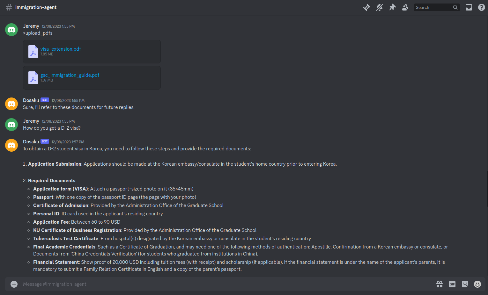

# Installation

Install the dosaku package as usual. As the app is standalone, either pip install dosaku directly or set your PythonPath 
variable to include the dosaku root directory.

I.e. start with

```commandline
[Create a Python virtual environment, as desired, using Python 3.10 or higher]
git clone git@github.com:DosakuNet/dosaku.git && cd dosaku
```

And then do one of the following:

For a user install:

```commandline
python setup.py install
```

Or for a dev install:

```commandline
pip install -r requirements.txt
pip install -r dev_requirements.txt
```

If you do a dev install, when you run applications, be sure to add the dosaku path to your python path. E.g. to run the 
immigration agent app below, alter it to be analogous to (assuming dosaku is located at `${HOME}/dosaku`):

```commandline
PYTHONPATH=${HOME}/dosaku python dosaku/samples/immigration_agent/discord_bot.py --host http://localhost:8080/
```

# Running the Immigration Agent

Run the backend server:

```commandline
python -m gunicorn -w 1 -b localhost:8080 -k uvicorn.workers.UvicornWorker dosaku.samples.immigration_agent.server:app
```

Run the discord bot:

```commandline
python dosaku/samples/immigration_agent/discord_bot.py --host http://localhost:8080/
```

# Using the Immigration Agent

The Immigration Agent should now be accessible through whichever discord bot you logged in. I.e. if you are running 
Dosaku, you may DM Dosaku to get access to the agent:


